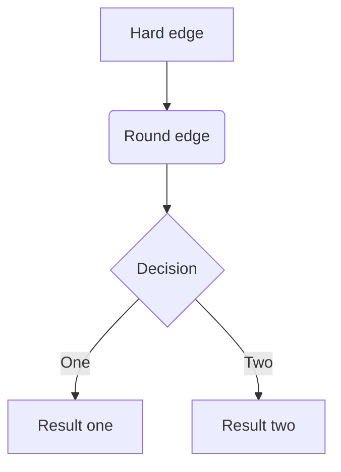

#   What did I learn

### Wed Aug 22 16:16:47 2018

```java
  1. AWS credentials (source_profile in config points to credentials)
  2. vim sudo save if in readonly file :w !sudo tee %
  3. ps -eux
  4. ps -ef

  echo dump | nc localhost 2181 | grep borkers -> echo sends the command to the next command pipeline

  sbt -J-Xms2048m -J-Xmx2048m assembly -> if out of heap memory

  Realized the need for this post

```

The schema generated from avro-tools can be copied and posted to Schema Registry

Questions:
1. How does that vim command work?

### Thu Aug 23 11:05:45 2018

`~;jetty:stop;jetty:start`

### Fri Aug 24 22:16:27 2018

CORS - how it works, breakdown, (browser based) and proxy solution
Write a blog post on CORS
Scala Futures (so cool) Future, Await, Future on maps (Future.sequence(x))


### Sat Aug 25 16:58:28 2018

Scalatra CORS support has a bug in allow-origin header not being sent
context.initParameters("org.scalatra.cors.allowCredentials") = "false"
Otherwise, we only see true when we should see *.
1. State machine!
    Edit Mode, New Mode, View Mode
2. Message Overlay - Modal
3. Different button to add / edit
3. Seperate UI from Code
4. Github etc.
5. Quick Filter?

Local performance of stuff gets degraded over time. What could it mean? Or how to restart? We can't let it happen in prod?

### Mon Aug 27 22:30:40 2018

Forwards vs Backwards vs Full Avro Compatibility
idea . (script to start IDEA in process)
Datadog reporter is different from Datadog agent

### Tue Aug 28 20:32:36 2018


### Wed Aug 29 14:03:03 2018

private[this] = private
performace vs consistent style
If IntelliSense is turned off, check to see if sources root is set correctly (scala)
Also, project root may be set as sources root, which if, then unmark

### Thu Aug 30 15:36:10 2018
John Lunch
Kafka Streams Viz
Workly
Bug: Retry forever policy, Not a bug
Zookeeper instances are out of sync

### Fri Aug 31 11:56:53 2018

How to run a process long running after logging in:
1) ./process &
2) screen/ tmux
3) nohup ./process &
4) Deamonize (start-stop-daemon)


### Tue Sep  4 12:45:36 2018

Scala () is different from {}, in which cases fully?

```scala
    startDatadogReporter.onComplete(
      case Success(_)
      => printlnMessage("DatadogReporter: Successfully started")
      case Failure(e)
      => printlnMessage("DatadogReporter: Not started: $e")
    )
    vs
        startDatadogReporter.onComplete {
      case Success(_)
      => printlnMessage("DatadogReporter: Successfully started")
      case Failure(e)
      => printlnMessage("DatadogReporter: Not started: " + e)
    }
```

    GitHub Wiki page _Sidebar

### Wed Sep  5 13:29:29 2018

1. http://james-iry.blogspot.com/2009/05/brief-incomplete-and-mostly-wrong.html

2. Figure out if you're on an EC2 instance: Hypervisor UUID
    head -c3 /sys/hypervisor/uuid

3. Use UserData to with cat <<EOF EOF to change a config

4. Implicit Classes (Augment a class)
```scala
    object Helpers {
  implicit class IntWithTimes(x: Int) {
    def times[A](f: => A): Unit = {
      def loop(current: Int): Unit =
        if(current > 0) {
          f
          loop(current - 1)
        }
      loop(x)
    }
  }
}
```

5. Map to List
```scala
var x = Map (
"a" -> "First",
"b" -> "Second"
)

x map {case(key, value) => s"$key:$value"} toList
```

### Thu Sep  6 11:21:56 2018
Exceptions being thrown because sbt assembly does not include that is in IDE classpath
Shaded jars, and their namespace, namely javax.ws.rs
Gah! To be continued
Solution: Merge strategy for sbt was discarding Manifest files, so class loader didn't know how to resolve the right library dynamically. It was picking the wrong one.


### Fri Sep  7 10:15:58 2018
Scala Cookbook
Primer on FP and Scala
Alvin Alexander is amazing


### Sun Sep  9 02:04:03 2018

Collect vs Map - similar semantics
Scala partial functions and the isDefinedAt, orElse
PartialFunction[-A, +B] - break down varying levels of complexity and compose with orElse

```scala
def longMethod {
  if x < 3 doThis
  if x < 5 doThis2
  if x < 7 doThis3
}
```
With PartialFunctions, you can 
```scala
def doThis: PartialFunction[Int, Int] = { case x: Int if x < 3 doThisLogic } 
doThis orElse doThis2 orElse doThis3
```

2.Partially-Applied Functions are different from PartialFunctions
   def plus(a: Int)(b: Int): Int = a + b

3. 
```scala
val vplus = (a: Int) => (b: Int) => a + b

def dplus(a: Int)(b: Int): Int = a + b

val dplus3 = dplus(3)(_)
val vplus3 = vplus(3)

dplus3(4)
vplus3(5)
```


````mermaid
sequenceDiagram
	A->>B: Hello Bob
	alt is sick
	Bob->>Alice: asdfasfa
	end
	Bob->>Cat: asadad        
````





#### Functional Programming

Managing complexity through functional composition


###Mon Sep 10, 2018

CSRF (commonly pronounced “sea-surf”)

Really cool tool called Hammerspoon - can be used to automate all sorts of stuff

###Tue Sep 12, 2018

Writing your own control structures in Scala. Incredibly powerful! Write a blog post on this

```scala
// Our own if/then/else 
def when[A](test: Boolean, whenTrue: A, whenFalse: A): A = 
  test match {
    case true  => whenTrue
    case false => whenFalse
  }

scala> when(1 == 2, "foo", "bar")
res13: String = bar

scala> when(1 == 1, "foo", "bar")
res14: String = foo

// Ok so far, but...

scala> when(1 == 1, println("foo"), println("bar"))
foo
bar

// that is weird
```


### Fri Sep 15, 2018

Scala you can create a tuple and declare what is inside together. The only benefit of such a statement is to keep related fields together.

```scala
// old way
val input = "In"
val output = "Out"

// new way
val (input, output) = ("In" "Out")
```


> IntelliJ show implicit parameters: `Command + Shift + P`


Embedded Kafka library uses the using patter

```scala
def withRunningKafkaOnFoundPort[T](config: EmbeddedKafkaConfig)(
      body: EmbeddedKafkaConfig => T): T = {
    withRunningZooKeeper(config.zooKeeperPort) { zkPort =>
      withTempDir("kafka") { kafkaLogsDir =>
        val broker: KafkaServer =
          startKafka(config.kafkaPort,
                     zkPort,
                     config.customBrokerProperties,
                     kafkaLogsDir)
        val actualConfig =
          EmbeddedKafkaConfigImpl(EmbeddedKafka.kafkaPort(broker),
                                  zkPort,
                                  config.customBrokerProperties,
                                  config.customProducerProperties,
                                  config.customConsumerProperties)
        try {
          body(actualConfig)
        } finally {
          broker.shutdown()
          broker.awaitShutdown()
        }
      }
    }
  }
```

### Tue Sep 18, 2018

https://www.scala-sbt.org/0.13/docs/Scopes.html


Sbt scopes with a RGB cube, pretty neat idea.

### Thu Sep 20, 2018

> SR Compatibility vs Evolution 
>
> 1. These two concepts are disjoint
> 2. SR allows for auto-selection of the correct schema, thus making the concept of evolution mute

- Consumers have the ability to use multiple schemas to read
- Producers are fixed to one schema


Since we are not going to **deprecate the old schemas**, we don’t have to worry about the evolution.


The value in evolution is a newer schema being able to read data, written using an old schema.

Blog post material


Avro backwards compatibility -> 

Backwards Evolution -> 


The typical levels (not transitive) are pretty useless, as any change can be made with the right set of deltas (add and remove). It only checks against the latest registered schema. 


#### Mon Oct 01, 2018

Commanders Intent

https://personalmba.com/commanders-intent/


#### Fri Oct 05, 2018

Sum from stdin in bash

```bash
curl localhost:8080/consumer/jfenocchi-2-average-rating2 | jq '.[].lag' -r | paste -sd+ | bc
```

#### Mon Oct 08, 2018
#### Thu Oct 11, 2018

How to learn - double-loop learning:

https://hbr.org/1991/05/teaching-smart-people-how-to-learn


#### Fri Oct 12, 2018

Historgrams, Latency, Why averages are misleading?

http://latencytipoftheday.blogspot.com/2014/06/latencytipoftheday-you-cant-average.html


https://queue.acm.org/detail.cfm?id=1809426


How to get things done, even if you don’t feel like it!

https://queue.acm.org/detail.cfm?id=3280677


#### Mon Oct 15, 2018

#### Tue Oct 16, 2018


Vitriol - cruel and bitter criticism.


GIT FLIGHT RULES - *Flight Rules* are the hard-earned body of knowledge recorded in manuals that list, step-by-step, what to do if X occurs, and why. Essentially, they are extremely detailed, scenario-specific standard operating procedures.

https://github.com/k88hudson/git-flight-rules

How to build good dashboards:

https://dataschool.com/courses/building-a-dashboard-best-practices/lessons/determine-the-metrics-to-monitor/


#### Wed Oct 17, 2018

Legibility with text on the computer


https://betterwebtype.com/rhythm-in-web-typography


Web Typography

https://betterwebtype.com/web-typography-resources


#### Fri Oct 19, 2018


**Find some string in all folder**


```bash
grep -rnw ‘.’ -e ‘8081’ // (look for port number in all configuration files)
```


#### Wed Oct 31, 2018

Hallows Eve

If looking for a good bash script to follow: ./confluent <- awesome

Ruby to write shell scripts


#### Mon Nov 05, 2018

Search of pids of all running java processes

pgrep -f java

#### Tue Nov 06, 2018

Assignment Branch Condition size for parse_commandline is too high

ABC check - your method does too much